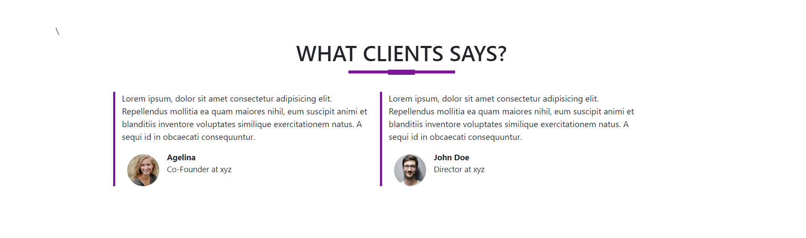
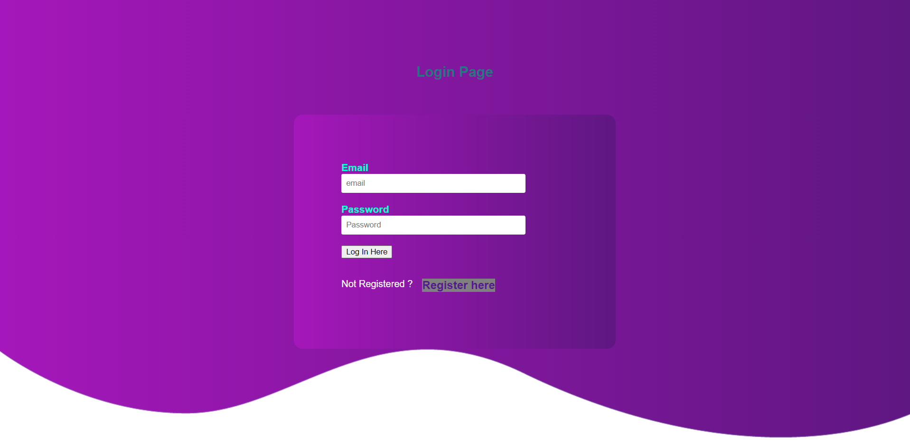

##  Pro Technical Service💻

 
 

    Description of Project

 
#### Front-end

- HTML 
- CSS 3
- JAVA SCRIPT
- Styling: PLANE CSS
 
 
#### Back-end

- For handling index requests: `Node.js with Express.js Framework`
- As Database: `MONGO DB`
- API tested using: `POSTMAN`
- Dependenc : `Bcrypt body-parser cors ditenv express nongoose`
 
 
 

## JS projectLists

| Project Name | Source-Code:Backend / Frontend|   Demo   | Descriptions |
| --- | --- | --- | --- | 
| Pro Technical Service  | [Click](https://github.com/sushantmiishra/protech-backend) /  [Click](https://github.com/sushantmiishra/protech-frontend)  | [Demo](https://sushantmiishra.github.io/protech-frontend/) | We provide best technical services and support.Pro Technical believe in customers wishes and expectations. |